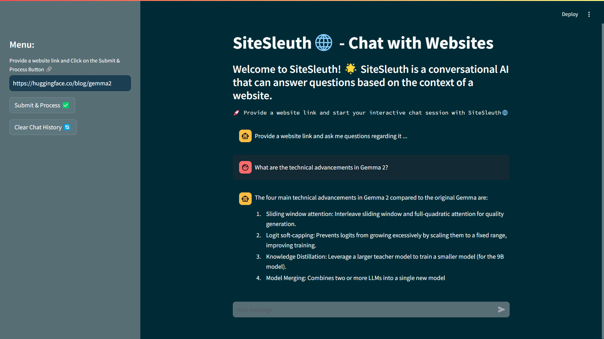

# SiteSleuth

This project empowers users to get the most out of any website by analyzing its content and answering questions based on the information found. SiteSleuth utilizes an Artificial Conversational Entity powered by the Gemini API. To know more about the project, refer to the [blog post](https://medium.com/google-cloud/how-to-create-an-ai-powered-website-analysis-chatbot-37d1ea8c4684).

Below is a screenshot of SiteSleuth in action:



## Project Structure

The project is structured as follows:

- `assets`: This directory contains the output responses screenshots.

- `src`: This directory contains the source code for the project.

  - `app`: This directory contains the code for actual model response generation.

    - `clear_history.py`: This file contains the code for clearing the chat history.
    - `response.py`: This file contains the code for the chatbot response generation.

  - `utils`: This directory contains the utility functions for the project.

    - `chain.py`: This file contains the conversation chain implementation.
    - `data_loader.py`: This file contains the code for loading the website data.
    - `embeddings.py`: This file contains the code for the embeddings generation.
    - `text_processing.py`: This file contains the code for further text processing like text splitting, chunking, etc.

  - `config.py`: This file contains the configuration for the Gemini API.
  - `exception.py`: This file contains the exception handling for the project.
  - `logger.py`: This file contains the project's logging configuration.

- `app.py`: This file contains the code for the Streamlit application.
- `Dockerfile`: This file contains the Docker configuration for the project.
- `.dockerignore`: This file contains the files to be ignored by Docker.
- `.gitignore`: This file contains the files to be ignored by Git.
- `.gcloudignore`: This file contains the files to be ignored by Google Cloud.
- `.env.example`: This file contains the environment variables required for the project.
- `requirements.txt`: This file contains the required dependencies for the project.
- `README.md`: This file contains the project documentation.
- `LICENSE`: This file contains the project license.

## Technologies Used

- **Python**: Python is used as the primary programming language for this project.
- **Gemini API**: These APIs provide advanced natural language processing and computer vision capabilities.
- **Langchain**: Langchain is used for the RAG (Retrieval Augmented Generation) implementation.
- **Chroma DB**: Chroma DB is used as the vector store for the embeddings.
- **Streamlit**: Streamlit is used for building interactive UIs for the chat interface.
- **Docker**: Docker is used to containerize the application.
- **Cloud Run**: Google Cloud Run is used to deploy the containerized application.
- **Cloud Build**: Google Cloud Build is used for setting up the CI/CD pipeline.

## Getting Started

To get started with this project, follow the steps below:

1. Clone the repository: `git clone https://github.com/sitamgithub-MSIT/SiteSleuth.git`
2. Change the directory: `cd SiteSleuth`
3. Create a virtual environment: `python -m venv tutorial-env`
4. Activate the virtual environment:
   - Windows: `tutorial-env\Scripts\activate`
   - Unix-based systems: `source tutorial-env/bin/activate`
5. Install the required dependencies: `pip install -r requirements.txt`
6. Run the Gradio application: `streamlit run app.py`

**Note**: You need to have the Gemini API key to run the application. You can get the API key by signing up on the [Gemini API](https://aistudio.google.com/). Once you have the API key, create a `.env` file in the root directory and add the following environment variables provided in the `.env.example` file. Replace the values with your API key.

```bash
GOOGLE_API_KEY=YOUR_GEMINI_API_KEY
USER_AGENT=YOUR_USER_AGENT_NAME
```

Now, open up your local host and you should see the web application running. For more information, refer to the Streamlit documentation [here](https://docs.streamlit.io/). Also, a live version of the application can be found [here](https://sitesleuth-a4zzrfnhrq-uc.a.run.app/) deployed on Google Cloud Run.

## Usage

Once the application is up and running, you can interact with the conversational entity through the provided UI. It can analyze the content of websites and answer your questions based on the information found.

### Example

1. Open the application in your browser.
2. Provide a website link in the input field.
3. Hit the "Submit" button.
4. Once it is "Done", you can ask questions in the chatbot.
5. The chatbot will analyze the content and provide a detailed response.

## Contributing

Contributions are welcome! If you would like to contribute to this project, please raise an issue to discuss the changes you would like to make. Once the changes are approved, you can create a pull request.

## License

This project is licensed under the [MIT License](LICENSE).

## Contact

If you have any questions or suggestions regarding the project, feel free to reach out to me on my GitHub profile.

Happy coding! 🚀
